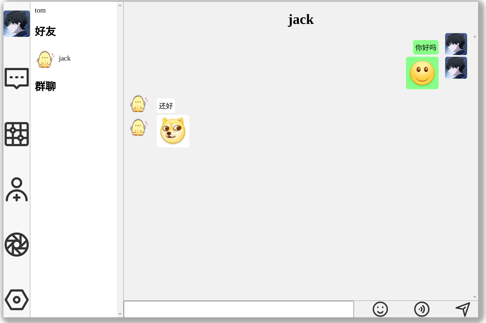
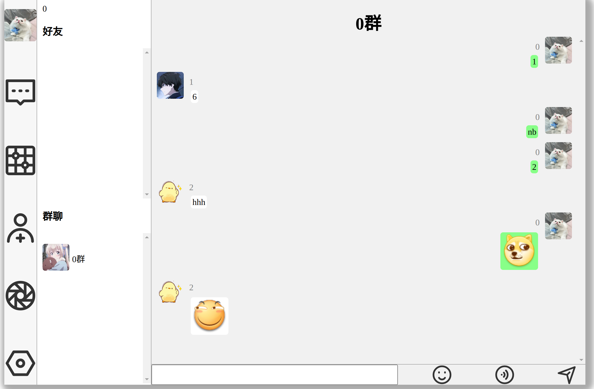
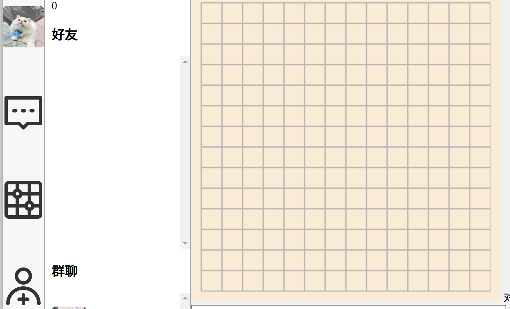

# im系统

# 支持功能
> 注册用户, 添加好友, 私聊, 群聊, 发送消息(支持 文本消息 图片消息 音频消息), 五子棋对战

# http
> 返回值格式 {"code":0, "msg":"", "data":null}
> 返回值描述 vvv
> code为0表示业务成功,-1表示业务失败
> msg表示返回响应的描述
> data表示返回值的负载数据

# websokcet
## 传输格式:
```go
// 请求对象, go
type Obj struct {
	// 消息id
	ID uint
	// 负载类型, 0:文本, 1:图片
	Type uint
	// 操作id
	ProcessId uint
	// 请求负载
	Payload string
}
```

```typescript
// 请求对象, typescript
class Request {  
    // 消息id
    ID: ID
    // 负载类型
    Type: Type
    // 接收方id
    ProcessId:number
    // 请求负载
    Payload:string
    constructor(id:ID, type:Type, processId:number, payload:string) {
        this.ID = id
        this.Type = type
        this.ProcessId = processId
        this.Payload = payload
    }
    toJson(): string {
        let s = JSON.stringify(this)
        return s
    }
}
```

# 请求id
```typescript
enum ID {
    // 获取好友会话
    GetFriendSession = 0,
    // 获取群聊会话
    GetGroupSession = 1,
    // 获取新好友信息
    GetNewFriend = 2,
    // 获取新群友消息
    GetNewGroup = 3,
    // 获取好友列表
    GetFriendList = 4,
    // 获取群聊列表
    GetGroupList = 5,
    // 添加好友
    AddFriend = 6,
    // 添加群聊
    AddGroup = 7,
    // 发送好友消息
    SendFriendMsg = 8,
    // 发送群聊消息
    SendGroupMsg = 9,
    // 通过用户名称模糊查询用户
    GetFuzzyUserByUserName = 10,
    // 通过群聊名称模糊查询群聊
    GetFuzzyGroupByGroupName = 11,
    // 同意新好友请求
    AgreeNewFriend = 12,
    // 同意新群友请求
    AgreeNewGroup = 13,
    // 拒绝新好友请求
    RefuseNewFriend = 14,
    // 拒绝新群友请求
    RefuseNewGroup = 15,
}
```
## 好友聊天

## 群聊

## 五子棋

